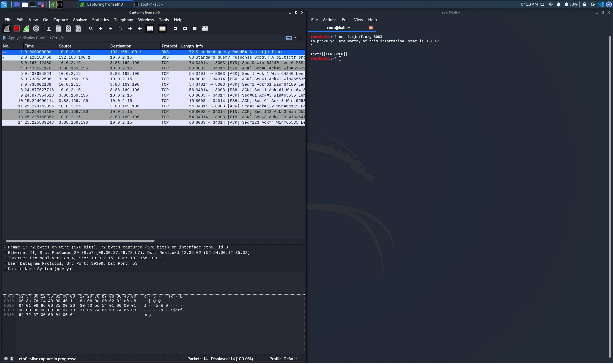
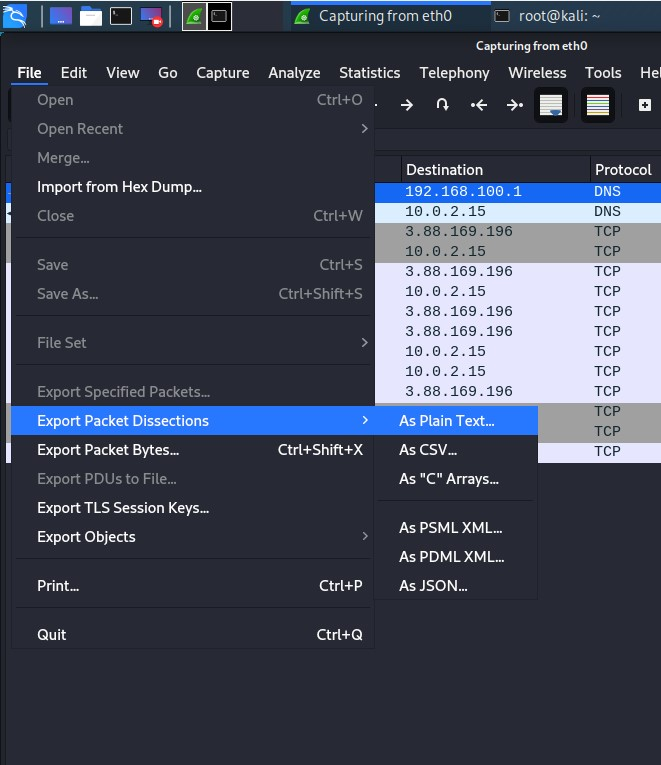
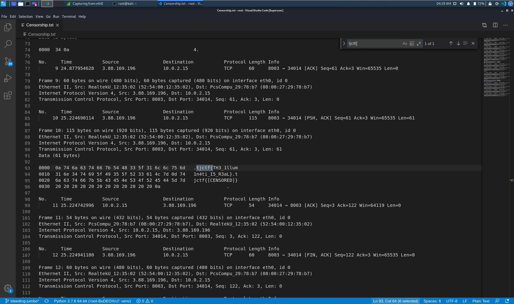

# Censorship

## Soal

My friend has some top-secret government intel. He left a message, but the government censored him! They didn't want the information to be leaked, but can you find out what he was trying to say? `nc p1.tjctf.org 8003`

## Solusi

1. Buka `Wireshark`, kemudian capture salah satu wired interface yang ada;
2. Jalankan perintah `nc p1.tjctf.org 8003` pada linux terminal, kemudian jawab pertanyaannya. Akan terdapat packet-packet baru yang tercapture oleh wireshark seperti pada gambar berikut.



3. Pada wireshark, export packet dengan cara pilih `File - Export Packet Disserctions - As Plain Text...` ;



4. Buka packet yang telah diexport pada text editor, kemudian `ctrl + f` lalu ketik `"tjctf{"`. Maka flag akan terlihat seperti pada gambar berikut.



## Flag

```
tjctf{TH3_1llum1n4ti_I5_R3aL}
```