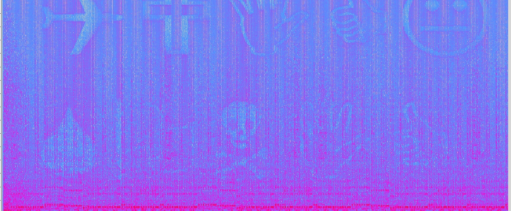

# Rap God

## Soal

My rapper friend Big Y sent me his `latest track` but something sounded a little off about it. Help me find out if he was trying to tell me something with it. Submit your answer as tjctf{message}

## Solusi

1. Lakukan pengunduhan file `.mp3` dari soal tersebut.
2. Dengan menggunakan aplikasi `Accoustic Spectrum Analyzer`, kita bisa melihat Spektrum Audio dari file `.mp3` tersebut. Hasil:

3. Pada hasil spektrum audio tersebut, dapat terlihat sebuah symbol-simbol. Simbol tersebut merupakan sebuah font yang bernama `Wingdings`. Font:

4. Terakhir lakukan konversi Simbol/Font tersebut menjadi huruf-huruf, maka akan didapatkannya sebuah kata yaitu `QUICKSONIC`.
5. masukkan kata tersebut dalam format flag: `tjctf{QUICKSONIC}`.

## Flag

```
tjctf{QUICKSONIC}
```